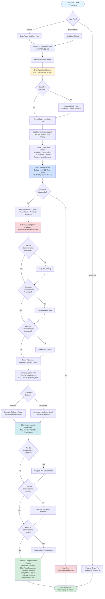

```mermaid
flowchart TD
    Start([Start: Multi-Chart Processing]) --> Input{Input Type?}
    
    Input -->|Folder| ScanFolder[Scan Folder for Chart Files]
    Input -->|Multiple Files| ValidateFiles[Validate All Files]
    Input -->|Single File| SingleFile[Process Single File<br/>Backward Compatible]
    
    ScanFolder --> CollectFiles[Collect All Supported Files<br/>PDF, TXT, DOCX]
    ValidateFiles --> CollectFiles
    
    CollectFiles --> ReadFiles[Read Each File Content]
    
    ReadFiles --> IdentifyTypes[Chart Type Identification<br/>LLM Classifies Each Chart]
    
    IdentifyTypes --> TypeCheck{Chart Type<br/>Identified?}
    TypeCheck -->|Yes| ExtractDates[Extract Dates from Each Chart]
    TypeCheck -->|No| DefaultType[Assign Default Type<br/>Based on Content Analysis]
    DefaultType --> ExtractDates
    
    ExtractDates --> SortChronological[Sort Charts Chronologically<br/>By Date + Chart Type Priority]
    
    SortChronological --> CombineCharts[Combine Charts with Markers<br/>Add Chart Type Prefixes<br/>Add Temporal Markers<br/>Preserve Line Numbers]
    
    CombineCharts --> MultiChartExtraction[Multi-Chart Extraction<br/>Extract from ALL Chart Types<br/>Not Just Operative Reports]
    
    MultiChartExtraction --> ExtractOutput{Extraction<br/>Successful?}
    ExtractOutput -->|No| Error1[Log Error<br/>Return Partial Results]
    ExtractOutput -->|Yes| BuildContext[Build Multi-Chart Context<br/>Chart Types + Temporal Sequence]
    
    BuildContext --> ComplianceEval[Multi-Chart Compliance Evaluation<br/>Evaluate Across ALL Charts]
    
    ComplianceEval --> CheckPreOp{Pre-Op<br/>Documentation<br/>Complete?}
    CheckPreOp -->|No| GapPreOp[Flag Pre-Op Gap]
    CheckPreOp -->|Yes| CheckOperative{Operative<br/>Documentation<br/>Complete?}
    
    GapPreOp --> CheckOperative
    
    CheckOperative -->|No| GapOperative[Flag Operative Gap]
    CheckOperative -->|Yes| CheckPostOp{Post-Op<br/>Documentation<br/>Complete?}
    
    GapOperative --> CheckPostOp
    
    CheckPostOp -->|No| GapPostOp[Flag Post-Op Gap]
    CheckPostOp -->|Yes| CrossReference[Cross-Reference<br/>Information Across Charts]
    
    GapPostOp --> CrossReference
    
    CrossReference --> EvidenceExtraction[Extract Evidence with<br/>Chart Type References<br/>e.g., L045 in operative_note]
    
    EvidenceExtraction --> ComplianceDecision{Compliance<br/>Decision}
    
    ComplianceDecision -->|Sufficient| GenerateSufficient[Generate Sufficient Result<br/>With Evidence Citations]
    ComplianceDecision -->|Insufficient| GenerateInsufficient[Generate Insufficient Result<br/>With Gap Analysis]
    
    GenerateSufficient --> ChartImprovement
    GenerateInsufficient --> ChartImprovement
    
    ChartImprovement[Chart Improvement Generation<br/>Map Improvements to Chart Types]
    
    ChartImprovement --> ImprovePreOp{Pre-Op<br/>Improvements<br/>Needed?}
    ImprovePreOp -->|Yes| SuggestPreOp[Suggest Pre-Op Additions]
    ImprovePreOp -->|No| ImproveOperative{Operative<br/>Improvements<br/>Needed?}
    
    SuggestPreOp --> ImproveOperative
    
    ImproveOperative -->|Yes| SuggestOperative[Suggest Operative Additions]
    ImproveOperative -->|No| ImprovePostOp{Post-Op<br/>Improvements<br/>Needed?}
    
    SuggestOperative --> ImprovePostOp
    
    ImprovePostOp -->|Yes| SuggestPostOp[Suggest Post-Op Additions]
    ImprovePostOp -->|No| GenerateOutput
    
    SuggestPostOp --> GenerateOutput
    
    GenerateOutput[Generate Comprehensive Output<br/>Extraction Summary<br/>Chart Type Breakdown<br/>Temporal Analysis<br/>Compliance Results<br/>Evidence Citations<br/>Improved Charts]
    
    GenerateOutput --> End([End: Multi-Chart Processing Complete])
    
    Error1 --> End
    SingleFile --> End
    
    style Start fill:#e1f5ff
    style End fill:#d4edda
    style IdentifyTypes fill:#fff3cd
    style MultiChartExtraction fill:#cfe2ff
    style ComplianceEval fill:#f8d7da
    style ChartImprovement fill:#d1ecf1
    style GenerateOutput fill:#d4edda
    style Error1 fill:#f8d7da
```