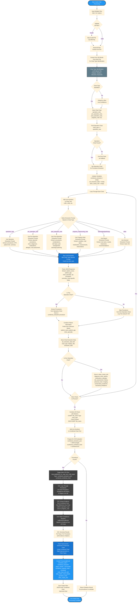

```mermaid
%%{init: {'theme':'base', 'themeVariables': { 'fontSize':'16px'}}}%%
flowchart TD
    Start([Start: Multi-Chart Processing]) --> Input[Input Multiple Files<br/>PDF, TXT, DOCX]
    
    Input --> Validate{Validate<br/>All Files?}
    Validate -->|Invalid| Skip[Skip Invalid File<br/>Log Warning]
    Skip --> ReadFiles
    Validate -->|Valid| ReadFiles[Read All Files<br/>Extract Full Text]
    
    ReadFiles --> ExtractSample[Extract First 100 Words<br/>from Each File<br/>for Chart Type Identification]
    
    ExtractSample --> IdentifyType[Chart Type Identification<br/>LLM Call per File<br/>Analyze: Headers, Structure, Keywords]
    
    IdentifyType --> TypeResult{Chart Type<br/>Identified?}
    TypeResult -->|Yes| StoreType[Store Chart Type<br/>operative_note, pre_operative_note,<br/>post_operative_note, progress_note, etc.]
    TypeResult -->|No| DefaultType[Default to other<br/>Low Confidence]
    DefaultType --> StoreType
    
    StoreType --> FindOperative[Find Operative Chart<br/>chart_type == operative_note]
    
    FindOperative --> OperativeCheck{Operative<br/>Chart Found?}
    OperativeCheck -->|Yes| SetOperative[Set Operative Chart<br/>for Procedure Extraction]
    OperativeCheck -->|No| UseFirst[Use First Chart<br/>as Fallback]
    UseFirst --> SetOperative
    
    SetOperative --> InitVars[Initialize Variables<br/>combined_extraction = empty<br/>all_extraction_data = empty<br/>other_charts_info = empty]
    
    InitVars --> LoopStart[Loop Through Each Chart]
    
    LoopStart --> AddLineNumbers[Add Line Numbers<br/>to Chart Text<br/>L001, L002, etc.]
    
    AddLineNumbers --> SelectPrompt{Select Extraction Prompt<br/>Based on Chart Type}
    
    SelectPrompt -->|operative_note| OpPrompt[Use Operative<br/>Extraction Prompt<br/>Extract: procedures, CPT,<br/>patient info, summary]
    SelectPrompt -->|pre_operative_note| PreOpPrompt[Use Pre-Operative<br/>Extraction Prompt<br/>Extract: planned procedures,<br/>tests, diagnoses, medications,<br/>allergies, risk assessment]
    SelectPrompt -->|post_operative_note| PostOpPrompt[Use Post-Operative<br/>Extraction Prompt<br/>Extract: procedures, complications,<br/>vital signs, pain management,<br/>discharge planning]
    SelectPrompt -->|progress_note/nursing_note| ProgressPrompt[Use Progress Note<br/>Extraction Prompt<br/>Extract: condition, vital signs,<br/>medications, assessments,<br/>interventions]
    SelectPrompt -->|lab/imaging/pathology| ReportPrompt[Use Report<br/>Extraction Prompt<br/>Extract: test name, results,<br/>impression, recommendations]
    SelectPrompt -->|other| GeneralPrompt[Use General<br/>Extraction Prompt<br/>Extract: basic info]
    
    OpPrompt --> RunExtraction
    PreOpPrompt --> RunExtraction
    PostOpPrompt --> RunExtraction
    ProgressPrompt --> RunExtraction
    ReportPrompt --> RunExtraction
    GeneralPrompt --> RunExtraction
    
    RunExtraction[Run LLM Extraction<br/>with Chart-Type-Specific Prompt<br/>Cache by chart_type]
    
    RunExtraction --> ParseJSON[Parse JSON Response<br/>Extract: patient_name, patient_age,<br/>chart_specialty, cpt, procedure,<br/>summary, chart-specific fields]
    
    ParseJSON --> IsOperative{Is This<br/>Operative Chart?}
    
    IsOperative -->|Yes| ExtractProcedures[Extract Procedures<br/>from Operative Chart<br/>Store in combined_extraction.procedure]
    IsOperative -->|No| SkipProcedures[Skip Procedures<br/>from Non-Operative Chart<br/>Log: Not using for CDI]
    
    ExtractProcedures --> CombinePatientInfo
    SkipProcedures --> CombinePatientInfo
    
    CombinePatientInfo[Combine Patient Information<br/>Prefer Non-Unknown Values<br/>patient_name, patient_age,<br/>chart_specialty]
    
    CombinePatientInfo --> StoreChartData[Store Chart Extraction Data<br/>all_extraction_data with<br/>chart_type, display_title,<br/>extraction_data]
    
    StoreChartData --> StoreOtherInfo{Is Non-Operative<br/>Chart?}
    
    StoreOtherInfo -->|Yes| StoreOther[Store in other_charts_info<br/>diagnosis, tests, reports,<br/>medications, allergies,<br/>risk_assessment, history,<br/>physical_exam, imaging,<br/>conservative_treatment,<br/>functional_limitations]
    StoreOtherInfo -->|No| NextChart
    
    StoreOther --> NextChart{More Charts<br/>to Process?}
    NextChart -->|Yes| LoopStart
    NextChart -->|No| CombineCharts
    
    CombineCharts[Combine All Charts<br/>with Markers<br/>CHART: file_name Type: chart_type<br/>Chart Content<br/>END CHART: file_name]
    
    CombineCharts --> AddCombinedLineNumbers[Add Line Numbers<br/>to Combined Chart Text]
    
    AddCombinedLineNumbers --> PrepareCDI[Prepare for CDI Evaluation<br/>combined_extraction_json = JSON.stringify<br/>numbered_combined_chart = combined text]
    
    PrepareCDI --> CheckProcedures{Procedures<br/>Found?}
    
    CheckProcedures -->|No| NoProcedures[Return Skeleton Result<br/>No procedures to evaluate]
    CheckProcedures -->|Yes| TriggerCDI
    
    TriggerCDI[Trigger Main CDI Flow<br/>map_guidelines_for_case_text_multi_payer<br/>Input: combined_extraction_json,<br/>numbered_combined_chart]
    
    TriggerCDI --> CDILoop[CDI: Loop Through Procedures<br/>For Each Procedure:<br/>Evaluate for All Payers<br/>in Single LLM Call]
    
    CDILoop --> CDIExtract[CDI: Extract Evidence<br/>from Combined Chart<br/>Can Reference Any Chart<br/>L045 in operative_note<br/>L012 in progress_note]
    
    CDIExtract --> CDIDecision[CDI: Make Compliance Decision<br/>Sufficient/Insufficient<br/>Based on Evidence from<br/>All Charts]
    
    CDIDecision --> CDIResults[CDI: Generate Results<br/>Per Payer, Per Procedure<br/>with Evidence Citations]
    
    CDIResults --> ChartImprovement[Chart Improvement<br/>Generate AI-Improved Chart<br/>Using Combined Chart<br/>Map Improvements to Chart Types]
    
    ChartImprovement --> CreateResult[Create ProcessingResult<br/>extraction_data = combined_extraction<br/>payer_results = CDI results<br/>numbered_medical_chart = combined<br/>multi_chart_info with<br/>total_charts, chart_details,<br/>operative_chart, other_charts_info]
    
    CreateResult --> SaveOutput[Save Output Files<br/>JSON result, numbered chart,<br/>improved chart]
    
    SaveOutput --> End([End: Multi-Chart<br/>Processing Complete])
    
    NoProcedures --> End
    
    style Start fill:#2196F3,stroke:#333,stroke-width:3px,color:#fff
    style End fill:#2196F3,stroke:#333,stroke-width:3px,color:#fff
    style IdentifyType fill:#607D8B,stroke:#333,stroke-width:2px,color:#fff
    style RunExtraction fill:#1976D2,stroke:#333,stroke-width:2px,color:#fff
    style TriggerCDI fill:#424242,stroke:#333,stroke-width:2px,color:#fff
    style CDILoop fill:#424242,stroke:#333,stroke-width:2px,color:#fff
    style CDIExtract fill:#424242,stroke:#333,stroke-width:2px,color:#fff
    style CDIDecision fill:#424242,stroke:#333,stroke-width:2px,color:#fff
    style ChartImprovement fill:#1976D2,stroke:#333,stroke-width:2px,color:#fff
    style CreateResult fill:#2196F3,stroke:#333,stroke-width:2px,color:#fff
```
