# Multi-Chart Inpatient Record Processing Workflow

## Overview
This document describes the complete workflow for processing multiple medical charts as a unified inpatient record. The system accepts a folder containing all related charts or multiple individual files, identifies chart types, processes them chronologically, and performs comprehensive CDI compliance evaluation across the entire patient encounter.

---

## Workflow Steps

### 1. Input Stage
**Input Options:**
- **Option A:** Folder/directory containing multiple chart files
- **Option B:** List of individual chart file paths
- **Option C:** Single file (backward compatible)

**Supported File Formats:**
- PDF (.pdf)
- Text files (.txt)
- Word documents (.docx, .doc)

**File Discovery:**
- System scans input folder for all supported file types
- Validates each file is readable and not corrupted
- Collects file metadata (name, size, modification date)

---

### 2. Chart Type Identification Stage
**Purpose:** Identify what type of medical document each file represents

**Chart Type Detection Logic:**
The system uses LLM-based classification to identify chart types by analyzing:
- Document headers and section titles
- Keywords and medical terminology
- Document structure and format
- Temporal indicators (dates, "pre-operative", "post-operative", etc.)

**Chart Types Identified:**
- **Pre-Admission Records:** Pre-admission assessments, screening notes
- **Consultation Notes:** Specialist consultations, referral notes
- **Pre-Operative/Pre-Procedure:** Pre-op evaluations, pre-procedure assessments
- **Operative/Procedure Notes:** Surgical operative reports, procedure documentation
- **Anesthesia Records:** Anesthesia documentation (for surgical cases)
- **Recovery Notes:** Post-procedure recovery, PACU notes
- **Progress Notes:** Daily physician progress notes, attending notes
- **Nursing Notes:** Nursing documentation, shift notes
- **Post-Operative/Post-Procedure:** Post-op care documentation, follow-up notes
- **Discharge Summary:** Discharge documentation, final summaries

**Output:** Each file tagged with:
- Chart type classification
- Confidence score
- Detected specialty (surgery, cardiology, oncology, etc.)

---

### 3. Date Extraction and Chronological Sorting Stage
**Purpose:** Arrange charts in temporal order to understand the patient journey

**Date Extraction:**
- Extract dates from each chart (encounter date, procedure date, note date)
- Parse various date formats (MM/DD/YYYY, DD-MM-YYYY, etc.)
- Handle relative dates ("Day 1", "Post-op Day 2")
- Use file modification date as fallback if no date found in content

**Chronological Sorting:**
1. Sort by primary date (encounter/procedure date)
2. For same-day charts, sort by chart type priority:
   - Pre-admission → Consultation → Pre-op → Operative → Anesthesia → Recovery → Progress → Nursing → Post-op → Discharge
3. Handle edge cases (missing dates, ambiguous dates)

**Output:** Ordered list of charts with temporal sequence metadata

---

### 4. Chart Combination and Context Building Stage
**Purpose:** Combine all charts into a unified record while preserving chart type context

**Combination Strategy:**
- Each chart is prefixed with chart type marker: `[CHART_TYPE: pre_operative]`
- Each chart is prefixed with temporal marker: `[TIMELINE: before_procedure]`
- Line numbers are added with chart type prefix: `[pre_op]L001: ...`
- Charts are separated by clear delimiters: `\n\n=== [CHART_TYPE] ===\n\n`

**Context Preservation:**
- Maintain chart boundaries for evidence extraction
- Preserve original line numbers per chart
- Track which chart each piece of evidence comes from

**Output:** Combined multi-chart text with chart type and temporal markers

---

### 5. Multi-Chart Extraction Stage
**Purpose:** Extract structured data from all charts, not just operative reports

**Extraction Process:**
- LLM analyzes combined multi-chart text
- Extracts procedures from operative/procedure notes
- Extracts diagnoses from all chart types
- Extracts clinical details from progress notes, nursing notes
- Identifies patient information (name, age, specialty)
- Builds comprehensive clinical summary across all charts

**Extraction Output JSON:**
```json
{
  "patient_name": "John Doe",
  "patient_age": "52-year-old",
  "chart_specialty": "Orthopedic Surgery",
  "cpt": ["29827", "29826"],
  "procedure": ["Arthroscopic rotator cuff repair, right shoulder"],
  "summary": "52-year-old male with complete rotator cuff tear...",
  "chart_types": [
    {"file": "pre_op_eval.pdf", "type": "pre_operative", "date": "2024-01-15"},
    {"file": "operative_note.pdf", "type": "operative", "date": "2024-01-16"},
    {"file": "progress_note_day1.pdf", "type": "progress_note", "date": "2024-01-17"}
  ],
  "temporal_sequence": {
    "before_procedure": ["pre_op_eval.pdf"],
    "during_procedure": ["operative_note.pdf"],
    "after_procedure": ["progress_note_day1.pdf", "nursing_note_day1.pdf"]
  }
}
```

---

### 6. Multi-Chart Compliance Evaluation Stage
**Purpose:** Evaluate compliance considering documentation across all charts

**Evaluation Strategy:**
- For each procedure identified, check documentation across ALL relevant charts
- Pre-operative documentation: Check pre-op notes for medical necessity, indications
- Operative documentation: Check operative notes for procedure details, findings
- Post-operative documentation: Check progress notes for outcomes, complications
- Cross-reference information across chart types for completeness

**Evidence Extraction:**
- Evidence references include chart type: `"L045 in [operative_note]"`
- Evidence references include temporal context: `"L012 in [progress_note_day1] (post-op day 1)"`
- Multiple chart references for same requirement when applicable

**Compliance Decision:**
- Sufficient: All required documentation found across appropriate chart types
- Insufficient: Missing documentation in required chart types
- Recommendations specify which chart type needs improvement

---

### 7. Chart Improvement Generation Stage
**Purpose:** Generate AI-powered improvements mapped to appropriate chart types

**Improvement Strategy:**
- Analyze compliance gaps across all charts
- Map improvements to appropriate chart types:
  - Pre-op gaps → Suggest additions to pre-operative note
  - Operative gaps → Suggest additions to operative note
  - Post-op gaps → Suggest additions to progress notes
- Consider temporal context (can't add pre-op info after procedure)

**Output:** Improved charts with suggestions tagged by chart type

---

### 8. Output Generation Stage
**Purpose:** Generate comprehensive output with multi-chart context

**Output Components:**
1. **Extraction Summary:** Procedures, diagnoses, patient info from all charts
2. **Chart Type Breakdown:** List of all chart types processed
3. **Temporal Analysis:** Timeline of patient encounter
4. **Compliance Results:** Per-payer compliance with chart type references
5. **Evidence Citations:** All evidence with chart type and line number references
6. **Improvement Recommendations:** Mapped to specific chart types
7. **Improved Charts:** Enhanced versions of each chart type

---

## Complete Workflow Mermaid Flowchart

```mermaid
flowchart TD
    Start([Start: Multi-Chart Processing]) --> Input{Input Type?}
    
    Input -->|Folder| ScanFolder[Scan Folder for Chart Files]
    Input -->|Multiple Files| ValidateFiles[Validate All Files]
    Input -->|Single File| SingleFile[Process Single File<br/>Backward Compatible]
    
    ScanFolder --> CollectFiles[Collect All Supported Files<br/>PDF, TXT, DOCX]
    ValidateFiles --> CollectFiles
    
    CollectFiles --> ReadFiles[Read Each File Content]
    
    ReadFiles --> IdentifyTypes[Chart Type Identification<br/>LLM Classifies Each Chart]
    
    IdentifyTypes --> TypeCheck{Chart Type<br/>Identified?}
    TypeCheck -->|Yes| ExtractDates[Extract Dates from Each Chart]
    TypeCheck -->|No| DefaultType[Assign Default Type<br/>Based on Content Analysis]
    DefaultType --> ExtractDates
    
    ExtractDates --> SortChronological[Sort Charts Chronologically<br/>By Date + Chart Type Priority]
    
    SortChronological --> CombineCharts[Combine Charts with Markers<br/>Add Chart Type Prefixes<br/>Add Temporal Markers<br/>Preserve Line Numbers]
    
    CombineCharts --> MultiChartExtraction[Multi-Chart Extraction<br/>Extract from ALL Chart Types<br/>Not Just Operative Reports]
    
    MultiChartExtraction --> ExtractOutput{Extraction<br/>Successful?}
    ExtractOutput -->|No| Error1[Log Error<br/>Return Partial Results]
    ExtractOutput -->|Yes| BuildContext[Build Multi-Chart Context<br/>Chart Types + Temporal Sequence]
    
    BuildContext --> ComplianceEval[Multi-Chart Compliance Evaluation<br/>Evaluate Across ALL Charts]
    
    ComplianceEval --> CheckPreOp{Pre-Op<br/>Documentation<br/>Complete?}
    CheckPreOp -->|No| GapPreOp[Flag Pre-Op Gap]
    CheckPreOp -->|Yes| CheckOperative{Operative<br/>Documentation<br/>Complete?}
    
    GapPreOp --> CheckOperative
    
    CheckOperative -->|No| GapOperative[Flag Operative Gap]
    CheckOperative -->|Yes| CheckPostOp{Post-Op<br/>Documentation<br/>Complete?}
    
    GapOperative --> CheckPostOp
    
    CheckPostOp -->|No| GapPostOp[Flag Post-Op Gap]
    CheckPostOp -->|Yes| CrossReference[Cross-Reference<br/>Information Across Charts]
    
    GapPostOp --> CrossReference
    
    CrossReference --> EvidenceExtraction[Extract Evidence with<br/>Chart Type References<br/>e.g., L045 in operative_note]
    
    EvidenceExtraction --> ComplianceDecision{Compliance<br/>Decision}
    
    ComplianceDecision -->|Sufficient| GenerateSufficient[Generate Sufficient Result<br/>With Evidence Citations]
    ComplianceDecision -->|Insufficient| GenerateInsufficient[Generate Insufficient Result<br/>With Gap Analysis]
    
    GenerateSufficient --> ChartImprovement
    GenerateInsufficient --> ChartImprovement
    
    ChartImprovement[Chart Improvement Generation<br/>Map Improvements to Chart Types]
    
    ChartImprovement --> ImprovePreOp{Pre-Op<br/>Improvements<br/>Needed?}
    ImprovePreOp -->|Yes| SuggestPreOp[Suggest Pre-Op Additions]
    ImprovePreOp -->|No| ImproveOperative{Operative<br/>Improvements<br/>Needed?}
    
    SuggestPreOp --> ImproveOperative
    
    ImproveOperative -->|Yes| SuggestOperative[Suggest Operative Additions]
    ImproveOperative -->|No| ImprovePostOp{Post-Op<br/>Improvements<br/>Needed?}
    
    SuggestOperative --> ImprovePostOp
    
    ImprovePostOp -->|Yes| SuggestPostOp[Suggest Post-Op Additions]
    ImprovePostOp -->|No| GenerateOutput
    
    SuggestPostOp --> GenerateOutput
    
    GenerateOutput[Generate Comprehensive Output<br/>Extraction Summary<br/>Chart Type Breakdown<br/>Temporal Analysis<br/>Compliance Results<br/>Evidence Citations<br/>Improved Charts]
    
    GenerateOutput --> End([End: Multi-Chart Processing Complete])
    
    Error1 --> End
    SingleFile --> End
    
    style Start fill:#e1f5ff
    style End fill:#d4edda
    style IdentifyTypes fill:#fff3cd
    style MultiChartExtraction fill:#cfe2ff
    style ComplianceEval fill:#f8d7da
    style ChartImprovement fill:#d1ecf1
    style GenerateOutput fill:#d4edda
    style Error1 fill:#f8d7da
```



---

## Key Features of the Workflow

### 1. Intelligent Chart Type Identification
- Uses LLM to analyze document structure and content
- Handles various naming conventions and formats
- Provides confidence scores for classification

### 2. Logical Temporal Processing
- Extracts dates from multiple formats
- Handles relative dates and day markers
- Sorts by date and chart type priority
- Maintains temporal context throughout processing

### 3. Context-Aware Evidence Extraction
- Evidence references include chart type
- Evidence references include temporal context
- Multiple chart references for comprehensive evidence

### 4. Specialty-Agnostic Design
- Works for surgery, cardiology, oncology, neurology, etc.
- Adapts chart type identification to specialty
- Handles specialty-specific documentation requirements

### 5. Backward Compatibility
- Single file processing still works
- Existing workflows remain functional
- Gradual migration path for multi-chart support

---

## Example Processing Flow

**Input:**
```
patient_123/
  ├── pre_op_evaluation_2024-01-15.pdf
  ├── operative_note_2024-01-16.pdf
  ├── progress_note_day1_2024-01-17.pdf
  ├── nursing_note_day1_2024-01-17.pdf
  └── discharge_summary_2024-01-20.pdf
```

**Processing Steps:**
1. **Identify Types:** pre_op, operative, progress_note, nursing_note, discharge_summary
2. **Extract Dates:** 2024-01-15, 2024-01-16, 2024-01-17, 2024-01-17, 2024-01-20
3. **Sort:** pre_op → operative → progress_note → nursing_note → discharge_summary
4. **Combine:** All charts combined with markers
5. **Extract:** Procedures from operative, diagnoses from all, clinical details from progress/nursing
6. **Evaluate:** Check pre-op for indications, operative for procedure details, post-op for outcomes
7. **Improve:** Suggest additions to appropriate chart types
8. **Output:** Comprehensive results with chart type references

---

## Error Handling

### Missing Chart Types
- System evaluates based on available charts
- Flags missing chart types as potential gaps
- Provides recommendations for missing documentation

### Date Ambiguity
- Uses file modification date as fallback
- Handles multiple date formats
- Warns when dates cannot be determined

### Chart Type Classification Failure
- Falls back to content-based classification
- Uses file name patterns as secondary method
- Logs classification confidence for review

---

## Performance Considerations

### Optimization Strategies
- Parallel file reading where possible
- Caching of chart type classifications
- Batch processing of similar chart types
- Incremental processing for large record sets

### Scalability
- Handles 1-50+ charts per patient record
- Efficient memory management for large charts
- Streaming processing for very large files

---

## Integration Points

### API Integration
- REST API endpoint: `POST /process-multiple-charts`
- Accepts folder path or list of file paths
- Returns unified processing result

### CLI Integration
- `python main.py --folder /path/to/charts`
- `python main.py file1.pdf file2.pdf file3.pdf`
- Backward compatible: `python main.py single_file.pdf`

### UI Integration
- Streamlit: Multi-file upload with folder support
- Dashboard: Batch processing with chart type visualization
- File browser: Select folder or individual files

---

## Testing Scenarios

### Test Case 1: Complete Surgical Record
- Pre-op, operative, post-op, progress notes, nursing notes
- Verify all chart types identified
- Verify chronological sorting
- Verify cross-chart evidence extraction

### Test Case 2: Incomplete Record
- Only operative note available
- Verify graceful handling of missing charts
- Verify recommendations for missing documentation

### Test Case 3: Non-Surgical Specialty
- Cardiology procedure with consultation, procedure note, follow-up
- Verify specialty-agnostic processing
- Verify appropriate chart type identification

### Test Case 4: Single File (Backward Compatibility)
- Single operative report
- Verify backward compatibility
- Verify single-file processing works as before

---

## Future Enhancements

1. **Chart Type Learning:** Machine learning model for chart type classification
2. **Temporal Relationship Detection:** Automatic detection of chart relationships
3. **Smart Chart Grouping:** Group related charts automatically
4. **Real-time Processing:** Stream processing for live chart updates
5. **Chart Quality Scoring:** Quality metrics per chart type

