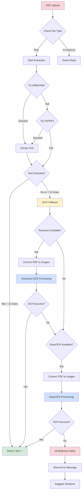

## Extraction Flow Diagram

```mermaid
flowchart TD
    A[PDF Upload] --> B{Check File Type}
    B -->|PDF| C[Start Extraction]
    B -->|TXT/DOCX| Z[Direct Read]
    
    C --> D{Try pdfplumber}
    D -->|Success| E[Extract Text]
    D -->|Fail| F{Try PyPDF2}
    
    F -->|Success| E
    F -->|Fail| G{Text Extracted?}
    
    E --> G
    G -->|Yes &gt; 10 chars| H[Return Text ✓]
    G -->|No or &lt; 10 chars| I[OCR Fallback]
    
    I --> J{Tesseract Available?}
    J -->|Yes| K[Convert PDF to Images]
    K --> L[Tesseract OCR Processing]
    L --> M{OCR Success?}
    
    M -->|Yes| H
    M -->|No| N{EasyOCR Available?}
    
    J -->|No| N
    N -->|Yes| O[Convert PDF to Images]
    O --> P[EasyOCR Processing]
    P --> Q{OCR Success?}
    
    Q -->|Yes| H
    Q -->|No| R[All Methods Failed]
    
    R --> S[Show Error Message]
    S --> T[Suggest Solutions]
    
    style A fill:#f8d7da
    style H fill:#d4edda
    style R fill:#f8d7da
    style I fill:#fff3cd
    style L fill:#cfe2ff
    style P fill:#cfe2ff
```

