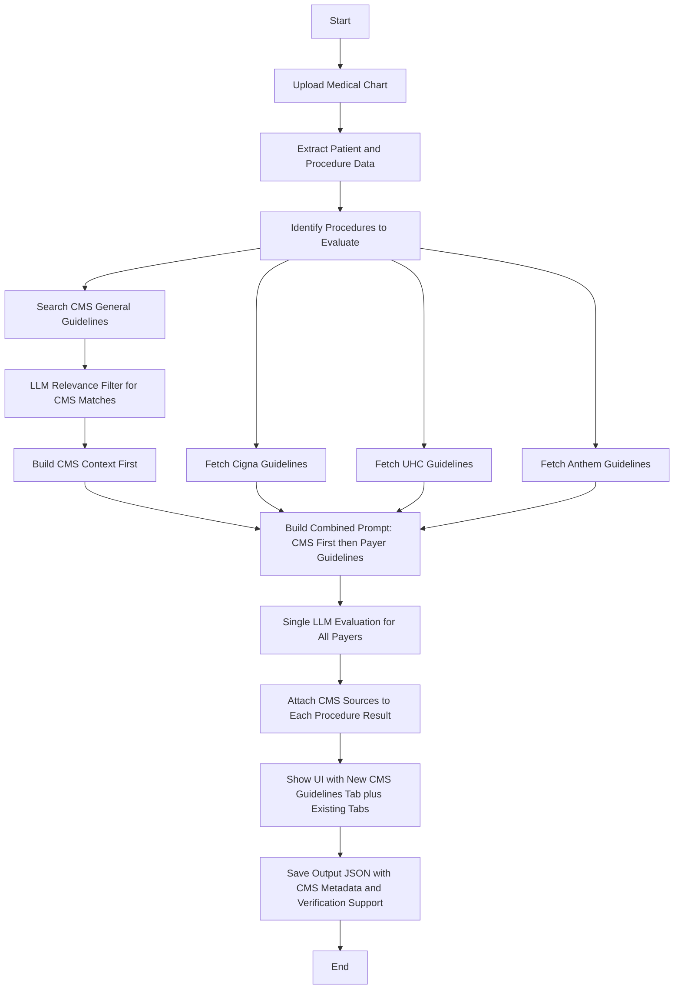

```mermaid
flowchart TD
    A[Start] --> B[Upload Medical Chart]
    B --> C[Extract Patient and Procedure Data]
    C --> D[Identify Procedures to Evaluate]

    D --> E[Search CMS General Guidelines]
    E --> F[LLM Relevance Filter for CMS Matches]
    F --> G[Build CMS Context First]

    D --> H[Fetch Cigna Guidelines]
    D --> I[Fetch UHC Guidelines]
    D --> J[Fetch Anthem Guidelines]

    G --> K[Build Combined Prompt: CMS First then Payer Guidelines]
    H --> K
    I --> K
    J --> K

    K --> L[Single LLM Evaluation for All Payers]
    L --> M[Attach CMS Sources to Each Procedure Result]
    M --> N[Show UI with New CMS Guidelines Tab plus Existing Tabs]
    N --> O[Save Output JSON with CMS Metadata and Verification Support]
    O --> P[End]
```

