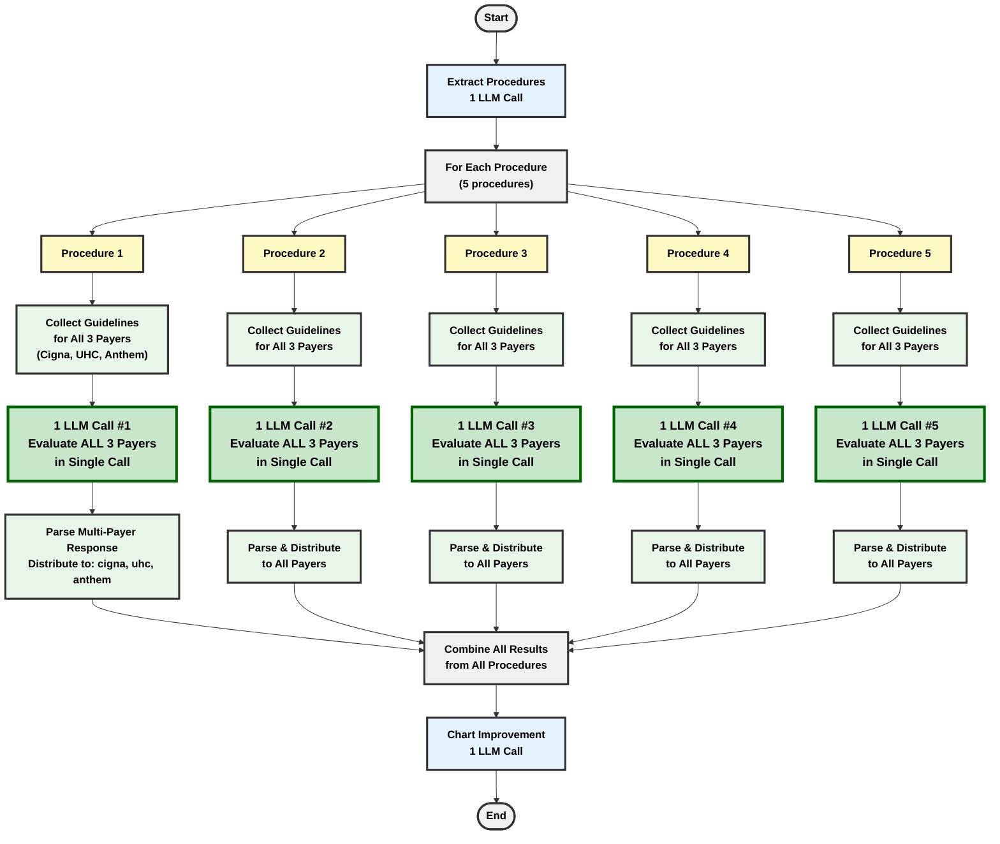

# AFTER: Optimized Approach (5 LLM Calls)

```mermaid
flowchart TD
    Start([Start]) --> Extract["Extract Procedures<br/><b>1 LLM Call</b>"]
    
    Extract --> ProcLoop["For Each Procedure<br/>(5 procedures)"]
    
    ProcLoop --> Proc1["Procedure 1"]
    Proc1 --> Collect1["Collect Guidelines<br/>for All 3 Payers<br/>(Cigna, UHC, Anthem)"]
    Collect1 --> Single1["<b>1 LLM Call #1</b><br/>Evaluate ALL 3 Payers<br/>in Single Call"]
    Single1 --> Parse1["Parse Multi-Payer Response<br/>Distribute to: cigna, uhc, anthem"]
    
    ProcLoop --> Proc2["Procedure 2"]
    Proc2 --> Collect2["Collect Guidelines<br/>for All 3 Payers"]
    Collect2 --> Single2["<b>1 LLM Call #2</b><br/>Evaluate ALL 3 Payers<br/>in Single Call"]
    Single2 --> Parse2["Parse & Distribute<br/>to All Payers"]
    
    ProcLoop --> Proc3["Procedure 3"]
    Proc3 --> Collect3["Collect Guidelines<br/>for All 3 Payers"]
    Collect3 --> Single3["<b>1 LLM Call #3</b><br/>Evaluate ALL 3 Payers<br/>in Single Call"]
    Single3 --> Parse3["Parse & Distribute<br/>to All Payers"]
    
    ProcLoop --> Proc4["Procedure 4"]
    Proc4 --> Collect4["Collect Guidelines<br/>for All 3 Payers"]
    Collect4 --> Single4["<b>1 LLM Call #4</b><br/>Evaluate ALL 3 Payers<br/>in Single Call"]
    Single4 --> Parse4["Parse & Distribute<br/>to All Payers"]
    
    ProcLoop --> Proc5["Procedure 5"]
    Proc5 --> Collect5["Collect Guidelines<br/>for All 3 Payers"]
    Collect5 --> Single5["<b>1 LLM Call #5</b><br/>Evaluate ALL 3 Payers<br/>in Single Call"]
    Single5 --> Parse5["Parse & Distribute<br/>to All Payers"]
    
    Parse1 --> Combine["Combine All Results<br/>from All Procedures"]
    Parse2 --> Combine
    Parse3 --> Combine
    Parse4 --> Combine
    Parse5 --> Combine
    
    Combine --> Chart["Chart Improvement<br/><b>1 LLM Call</b>"]
    Chart --> End([End])
    
    style Start fill:#f0f0f0,stroke:#333,stroke-width:3px,color:#000,font-weight:bold,font-size:16px
    style Extract fill:#e3f2fd,stroke:#333,stroke-width:3px,color:#000,font-weight:bold,font-size:16px
    style ProcLoop fill:#f0f0f0,stroke:#333,stroke-width:3px,color:#000,font-weight:bold,font-size:16px
    style Proc1 fill:#fff9c4,stroke:#333,stroke-width:3px,color:#000,font-weight:bold,font-size:16px
    style Proc2 fill:#fff9c4,stroke:#333,stroke-width:3px,color:#000,font-weight:bold,font-size:16px
    style Proc3 fill:#fff9c4,stroke:#333,stroke-width:3px,color:#000,font-weight:bold,font-size:16px
    style Proc4 fill:#fff9c4,stroke:#333,stroke-width:3px,color:#000,font-weight:bold,font-size:16px
    style Proc5 fill:#fff9c4,stroke:#333,stroke-width:3px,color:#000,font-weight:bold,font-size:16px
    style Collect1 fill:#e8f5e9,stroke:#333,stroke-width:3px,color:#000,font-weight:bold,font-size:16px
    style Collect2 fill:#e8f5e9,stroke:#333,stroke-width:3px,color:#000,font-weight:bold,font-size:16px
    style Collect3 fill:#e8f5e9,stroke:#333,stroke-width:3px,color:#000,font-weight:bold,font-size:16px
    style Collect4 fill:#e8f5e9,stroke:#333,stroke-width:3px,color:#000,font-weight:bold,font-size:16px
    style Collect5 fill:#e8f5e9,stroke:#333,stroke-width:3px,color:#000,font-weight:bold,font-size:16px
    style Single1 fill:#c8e6c9,stroke:#006600,stroke-width:4px,color:#000,font-weight:bold,font-size:18px
    style Single2 fill:#c8e6c9,stroke:#006600,stroke-width:4px,color:#000,font-weight:bold,font-size:18px
    style Single3 fill:#c8e6c9,stroke:#006600,stroke-width:4px,color:#000,font-weight:bold,font-size:18px
    style Single4 fill:#c8e6c9,stroke:#006600,stroke-width:4px,color:#000,font-weight:bold,font-size:18px
    style Single5 fill:#c8e6c9,stroke:#006600,stroke-width:4px,color:#000,font-weight:bold,font-size:18px
    style Parse1 fill:#e8f5e9,stroke:#333,stroke-width:3px,color:#000,font-weight:bold,font-size:16px
    style Parse2 fill:#e8f5e9,stroke:#333,stroke-width:3px,color:#000,font-weight:bold,font-size:16px
    style Parse3 fill:#e8f5e9,stroke:#333,stroke-width:3px,color:#000,font-weight:bold,font-size:16px
    style Parse4 fill:#e8f5e9,stroke:#333,stroke-width:3px,color:#000,font-weight:bold,font-size:16px
    style Parse5 fill:#e8f5e9,stroke:#333,stroke-width:3px,color:#000,font-weight:bold,font-size:16px
    style Combine fill:#f0f0f0,stroke:#333,stroke-width:3px,color:#000,font-weight:bold,font-size:16px
    style Chart fill:#e3f2fd,stroke:#333,stroke-width:3px,color:#000,font-weight:bold,font-size:16px
    style End fill:#f0f0f0,stroke:#333,stroke-width:3px,color:#000,font-weight:bold,font-size:16px
```
