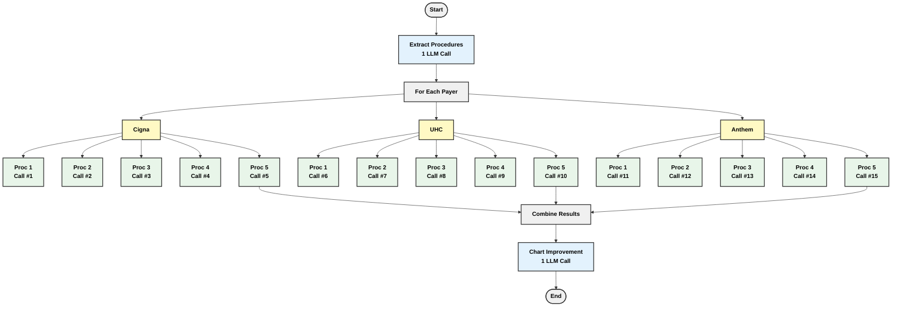

# BEFORE: Original Approach (15 LLM Calls)

```mermaid
flowchart TD
    Start([Start]) --> Extract[Extract Procedures<br/>1 LLM Call]
    
    Extract --> PayerLoop[For Each Payer]
    
    PayerLoop --> Cigna[Cigna]
    Cigna --> C1[Proc 1<br/>Call #1]
    Cigna --> C2[Proc 2<br/>Call #2]
    Cigna --> C3[Proc 3<br/>Call #3]
    Cigna --> C4[Proc 4<br/>Call #4]
    Cigna --> C5[Proc 5<br/>Call #5]
    
    PayerLoop --> UHC[UHC]
    UHC --> U1[Proc 1<br/>Call #6]
    UHC --> U2[Proc 2<br/>Call #7]
    UHC --> U3[Proc 3<br/>Call #8]
    UHC --> U4[Proc 4<br/>Call #9]
    UHC --> U5[Proc 5<br/>Call #10]
    
    PayerLoop --> Anthem[Anthem]
    Anthem --> A1[Proc 1<br/>Call #11]
    Anthem --> A2[Proc 2<br/>Call #12]
    Anthem --> A3[Proc 3<br/>Call #13]
    Anthem --> A4[Proc 4<br/>Call #14]
    Anthem --> A5[Proc 5<br/>Call #15]
    
    C5 --> Combine[Combine Results]
    U5 --> Combine
    A5 --> Combine
    
    Combine --> Chart[Chart Improvement<br/>1 LLM Call]
    Chart --> End([End])
    
    style Start fill:#f0f0f0,stroke:#333,stroke-width:2px,color:#000,font-weight:bold
    style Extract fill:#e3f2fd,stroke:#333,stroke-width:2px,color:#000,font-weight:bold
    style PayerLoop fill:#f0f0f0,stroke:#333,stroke-width:2px,color:#000,font-weight:bold
    style Cigna fill:#fff9c4,stroke:#333,stroke-width:2px,color:#000,font-weight:bold
    style UHC fill:#fff9c4,stroke:#333,stroke-width:2px,color:#000,font-weight:bold
    style Anthem fill:#fff9c4,stroke:#333,stroke-width:2px,color:#000,font-weight:bold
    style C1 fill:#e8f5e9,stroke:#333,stroke-width:2px,color:#000,font-weight:bold
    style C2 fill:#e8f5e9,stroke:#333,stroke-width:2px,color:#000,font-weight:bold
    style C3 fill:#e8f5e9,stroke:#333,stroke-width:2px,color:#000,font-weight:bold
    style C4 fill:#e8f5e9,stroke:#333,stroke-width:2px,color:#000,font-weight:bold
    style C5 fill:#e8f5e9,stroke:#333,stroke-width:2px,color:#000,font-weight:bold
    style U1 fill:#e8f5e9,stroke:#333,stroke-width:2px,color:#000,font-weight:bold
    style U2 fill:#e8f5e9,stroke:#333,stroke-width:2px,color:#000,font-weight:bold
    style U3 fill:#e8f5e9,stroke:#333,stroke-width:2px,color:#000,font-weight:bold
    style U4 fill:#e8f5e9,stroke:#333,stroke-width:2px,color:#000,font-weight:bold
    style U5 fill:#e8f5e9,stroke:#333,stroke-width:2px,color:#000,font-weight:bold
    style A1 fill:#e8f5e9,stroke:#333,stroke-width:2px,color:#000,font-weight:bold
    style A2 fill:#e8f5e9,stroke:#333,stroke-width:2px,color:#000,font-weight:bold
    style A3 fill:#e8f5e9,stroke:#333,stroke-width:2px,color:#000,font-weight:bold
    style A4 fill:#e8f5e9,stroke:#333,stroke-width:2px,color:#000,font-weight:bold
    style A5 fill:#e8f5e9,stroke:#333,stroke-width:2px,color:#000,font-weight:bold
    style Combine fill:#f0f0f0,stroke:#333,stroke-width:2px,color:#000,font-weight:bold
    style Chart fill:#e3f2fd,stroke:#333,stroke-width:2px,color:#000,font-weight:bold
    style End fill:#f0f0f0,stroke:#333,stroke-width:2px,color:#000,font-weight:bold
```
